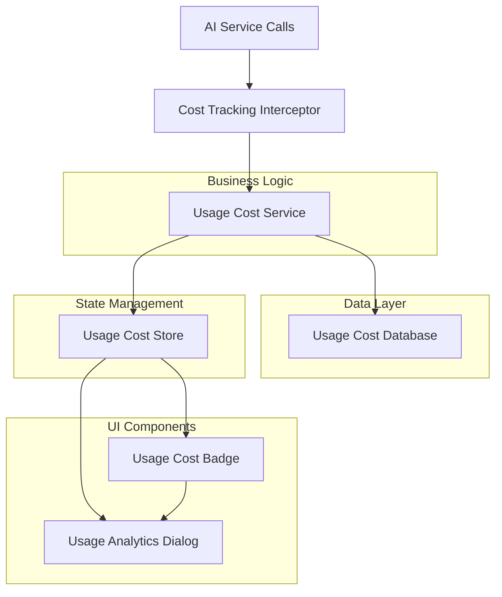

# Cost Analytics Feature Design

## Overview

The Cost Analytics feature provides comprehensive tracking and visualization of AI model usage costs. The system automatically captures token usage data from AI interactions, calculates associated costs, and presents analytics through a badge in the header and a detailed dialog interface. The design leverages existing patterns in the codebase including IndexedDB for persistence, Zustand for state management, and the established UI component architecture.

## Architecture

### High-Level Architecture



### Data Flow

1. **Usage Capture**: AI service calls are intercepted to capture token usage data
2. **Cost Calculation**: Token counts are multiplied by model pricing to calculate costs
3. **Data Persistence**: Usage records are stored in IndexedDB for persistence
4. **State Updates**: Zustand store is updated with new usage data
5. **UI Updates**: Components reactively update to reflect new usage data

## Components and Interfaces

### Core Data Models

```typescript
interface UsageRecord {
  id: string;
  timestamp: Date;
  modelName: string;
  inputTokens: number;
  outputTokens: number;
  inputCost: number;
  outputCost: number;
  totalCost: number;
  taskType: string; // 'chat', 'translate', 'enhance-prompt', 'generate-data'
}

interface UsageAnalytics {
  totalCost: number;
  totalTasks: number;
  totalInputTokens: number;
  totalOutputTokens: number;
  modelBreakdown: Record<string, {
    cost: number;
    tasks: number;
    inputTokens: number;
    outputTokens: number;
  }>;
  taskTypeBreakdown: Record<string, {
    cost: number;
    tasks: number;
  }>;
}

interface UsageFilter {
  timeRange: 'today' | '7days' | '30days' | '90days';
  models: string[];
  taskTypes: string[];
}
```

### Database Layer

**UsageCostDB** - IndexedDB wrapper following existing patterns:
- Stores `UsageRecord` objects with indexes on timestamp and modelName
- Provides methods for CRUD operations and filtered queries
- Handles data migration and cleanup for storage optimization

### Service Layer

**UsageCostService** - Core business logic:
- `recordUsage(tokens, model, taskType)` - Records new usage data
- `calculateCost(tokens, model)` - Calculates cost based on model pricing
- `getAnalytics(filter)` - Retrieves filtered analytics data
- `getTotalCost()` - Gets current total accumulated cost

**CostTrackingInterceptor** - Middleware for automatic usage capture:
- Intercepts AI service calls to extract token usage
- Integrates with existing chat, translate, and other AI services
- Handles different response formats from various AI providers

### State Management

**UsageCostSlice** - Zustand store slice:
- Manages current total cost for badge display
- Caches recent analytics data for performance
- Provides actions for updating usage data
- Integrates with existing AppStore structure

### UI Components

**UsageCostBadge** - Header display component:
- Shows formatted total cost (e.g., "$1.23")
- Positioned next to LocaleSwitcher in AppHeader
- Clickable to open analytics dialog
- Updates in real-time when new usage is recorded

**UsageAnalyticsDialog** - Detailed analytics modal:
- Displays comprehensive usage statistics
- Provides time-based filtering (Today, 7d, 30d, 90d)
- Offers model-based filtering with multi-select
- Shows task type breakdown and trends
- Includes data export functionality

## Data Models

### Storage Schema

```typescript
interface UsageCostDBSchema extends DBSchema {
  usageRecords: {
    key: string;
    value: UsageRecord;
    indexes: { 
      timestamp: Date;
      modelName: string;
      taskType: string;
    };
  };
}
```

### Cost Calculation Logic

Cost calculation leverages existing model pricing data from `types/model.ts`:

```typescript
const calculateCost = (inputTokens: number, outputTokens: number, model: ModelAI) => {
  const inputCost = (inputTokens / 1000000) * model.priceInput;
  const outputCost = (outputTokens / 1000000) * model.priceOutput;
  return {
    inputCost,
    outputCost,
    totalCost: inputCost + outputCost
  };
};
```

## Error Handling

### Database Errors
- Graceful degradation when IndexedDB is unavailable
- Fallback to localStorage for basic cost tracking
- Error logging for debugging storage issues

### Service Integration Errors
- Robust error handling for AI service integration failures
- Fallback cost estimation when exact token counts unavailable
- Retry mechanisms for failed usage recordings

### UI Error States
- Loading states for analytics data retrieval
- Error messages for failed operations
- Graceful handling of missing or corrupted data

## Testing Strategy

### Unit Tests
- **UsageCostService**: Test cost calculations, data filtering, analytics generation
- **UsageCostDB**: Test CRUD operations, indexing, data migration
- **CostTrackingInterceptor**: Test token extraction from various AI responses
- **UsageCostSlice**: Test state management and action dispatching

### Integration Tests
- **Service Integration**: Test automatic usage tracking across all AI features
- **Database Integration**: Test data persistence and retrieval workflows
- **UI Integration**: Test badge updates and dialog interactions

### Component Tests
- **UsageCostBadge**: Test display formatting, click handling, real-time updates
- **UsageAnalyticsDialog**: Test filtering, data visualization, export functionality

### Performance Considerations

- **Lazy Loading**: Analytics dialog loads data only when opened
- **Data Pagination**: Large usage datasets are paginated for performance
- **Caching Strategy**: Recent analytics cached in Zustand store
- **Storage Optimization**: Automatic cleanup of old usage records beyond retention period

### Security and Privacy

- **Local Storage Only**: All usage data stored locally in browser
- **No External Transmission**: Usage analytics never sent to external services
- **Data Anonymization**: No personally identifiable information in usage records
- **User Control**: Export and delete functionality for user data management